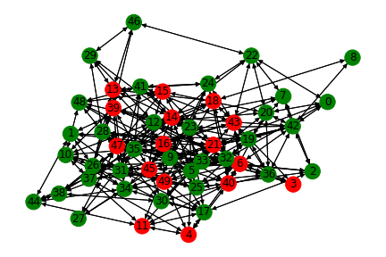
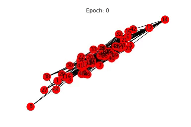

# DGL Library exploration

## Project overview
This is simple exploratory project of [DGL](https://www.dgl.ai/) that aim to 
discover possibilities of graph processing powered by Deep Learning.

## Project structure
```
repository_root
├── README.md                                       project description
├── requirements.txt                                dependecies definition
├── requirements-gpu.txt                            dependecies definition (GPU version)
├── resources                                       directory where to place data to be sued
├── notebooks                                       Jupyter notebooks with some experiments results.
└── src                                             main sources package
    └── config.py                                   global config of a project
```

## Setup
To set up the project:
* Create a conda environment (or venv if you like)
    ```bash
    conda create -n DGLExploration python=3.7
    ```
* Source the env
    ```bash
    conda activate DGLExploration
    ```
* Install requirements
    ```bash
    project_root$ pip install -r requirements.txt
    ```
    You can also install requirements suitable for GPU support 
    (in this case CUDA 10.0 is supported - check out [how to use different 
    version](https://docs.dgl.ai/en/0.4.x/install/)).
    ```bash
    project_root$ pip install -r requirements-gpu.txt
    ```
    Please note that according to [offcial pytorch documentation](https://pytorch.org/) 
    CUDA support is available for CUDA 9.2 (legacy) and CUDA 10.1.
    The strange issue that we could observe is that having installed CUDA 10.1
    (according to nvidia-smi):
    ```bash
    nvidia-smi
    Sat Apr 18 14:59:28 2020       
    +-----------------------------------------------------------------------------+
    | NVIDIA-SMI 430.40       Driver Version: 430.40       CUDA Version: 10.1     |
    |-------------------------------+----------------------+----------------------+
    ```
    The local CUDA version works fine with PyTorch (and other DL libraries), but 
    when DGL is installed with pip from ```dgl-cu100``` package there is an error
    saying no libcublas.so.10.0 despite the fact that required shared library is 
    present. The case may be that DGL looks for CUDA in fixed location per 
    version (which is not suitable for the local set-up we tested the library 
    on) instead to make use of __standard__ sym-link for CUDA which is 
    ```/usr/local/cuda```. This is strange, as a common way to obtain knowledge 
    about shared libraries locations from a code is to use ```LD_LIBRARY_PATH``` 
    which was correctly set on the machine we executed test.
### Issues with jupyter notebook
Sometimes, in order to make the environment visible in jupyter notebook, the 
following command needs to be executed.
```bash
(DGLExploration) python -m ipykernel install --name "DGLExploration" --user
```

## Project details
### Virus expansion simulation
#### Simulation rules
Simulation rules are extremely simple:
* People are located on map and can move in nine possible directions (including 
staying at given position) - space borders cannot be crossed out;
* Initial positions of people are randomly chosen;
* At each simulation step each person decides (by random choice) where
to go (only one step can be done); 
* Group of people being in certain position in certain time will set up a 
contact. Each person can meet another from a group and the intensity of 
pairwise contact is measured by intensity (random number from range [0.0; 1.0]);
* If within group there is a sick person - he/she may pass the virus to 
another person - the actual probability of virus transmission is 
calculated as contact_intensity * global_transition_probability and the 
transmission event is decided by a flip of Bayesian coin;
* Each person infected in time stamp _t_, starts infecting from time stamp 
_t+1_.

#### Usage
To run a simulation execute the following command:
```bash
(DGLExploration) project_root$ python -m src.virus_simulation.execute \
    --map_size=100 \
    --people_number=100 \
    --simulation_name=test_simulation \
    --steps=200 \
    --max_person_step_size=10
    --snapshot_steps 50 100 150 \
    --transmission_probability=0.75 \
    --initial_seek_people=1
```
Where:
* `--map_size` is a size of space to place virtual people
* `--people_number` is a number of simulated people
* `--simulation_name` is a distinguishable name of simulation that will be 
used to generate snapshots
* `--steps` is a number of simulation steps _(default: 100)_
* `--max_person_step_size` is maximum distance (along each dimension) that a 
simulated person can move in each simulation step _(default: 10)_
* `--snapshot_steps` are numbers of steps that simulation state snapshot will
be taken (apart from the last step which is enabled by default). _(default: not set)_
* `--transmission_probability` is a probability of virus transmission. _(default: 0.5)_
* `--initial_seek_people` is an initial number of people infected. _(default: 1)_


#### Results
One should expect results placed under location specified in 
`src.config.VIRUS_SIMULATION_OUTPUT_PATH` (located by design under `resources`).

The result format is the following:
```json
{
    "map_dimensions": [
        50,
        50
    ],
    "people": [
        {
            "person_id": 0,
            "person_sick": false,
            "sickness_start": null
        },
        {
            "person_id": 1,
            "person_sick": true,
            "sickness_start": 37
        }
    ],
    "contacts": [
      {
            "contact_pair": [
                16,
                34
            ],
            "contact_intensity": 0.7409445831243038,
            "contact_time_stamp": 64
        },
        {
            "contact_pair": [
                22,
                45
            ],
            "contact_intensity": 0.6641336785359672,
            "contact_time_stamp": 64
        }
    ],
    "people_traces": {
        "0": [
            [
                16,
                50
            ],
            [
                17,
                44
            ]
        ]
    }
}
```
General structure is the following:
```
{
    map_dimensions: 2D size of simulation map
    people: [
        {
            person_id: id of an individual
            person_sick: True/False
            sickness_start: time_stamp (simulation step) when sickness started
        }
    ]
    contacts: [
        {
            contact_pair: Pair of person_id
            contact_intensity: level of people exposure while contact
            contact_time_stamp: time_stamp (simulation step) when contact occured
        }
    ]
}
```

### Semi-supervised infected people detection
#### Experiment description
We are going to generate graph dataset of virus expansion in a population 
(as described in __Virus expansion simulation__ section). Then we are aim to 
prepare POC showing that with use of DGL and graph convolutional network (GCN) 
it is possible to detect people that may be sick on the basis of record of 
contacts between people when we are able to obtain a dose of tests results which 
serves as a base for semi-supervised training. Such infected people detection
can be useful (for instance while COVID-19 epidemic) as it could help to 
isolate potentially sick people on the basis of mobile devices tracking.

#### Experiment details
See the [POC here](notebooks/01_DGLSemiSupervisedPredictionsOnVertices.ipynb).

#### Results visualisation

| Ground Truth        | Model result           |
| ------------- |:-------------:|
|      |  |
